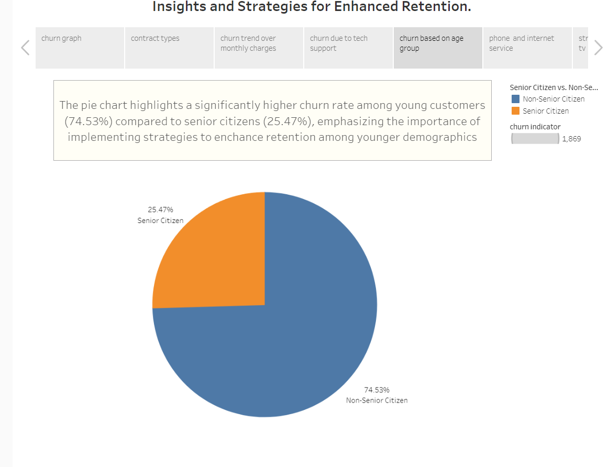
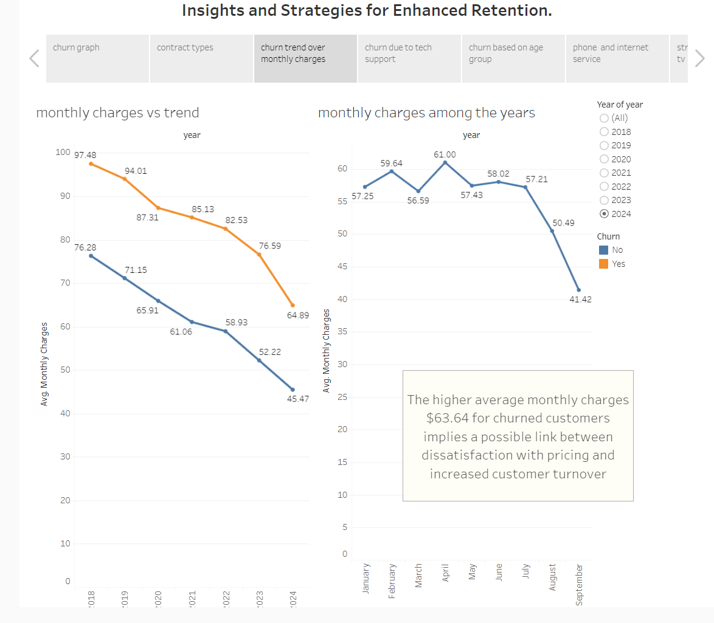
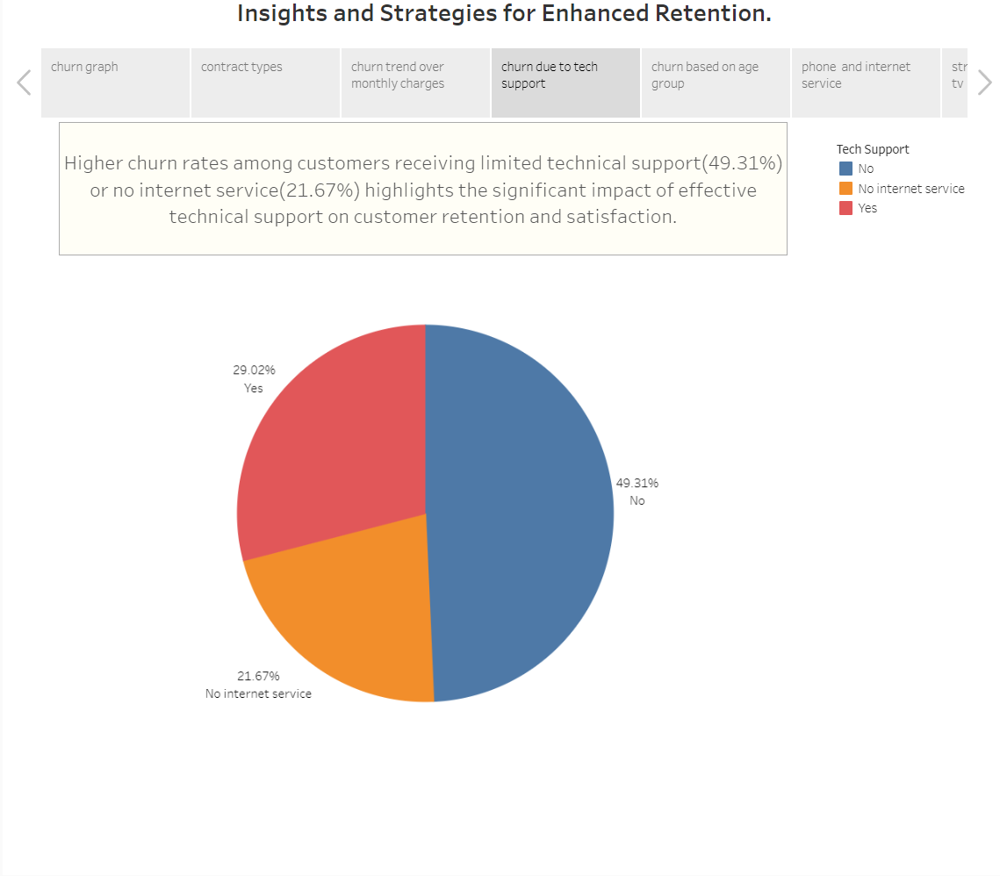
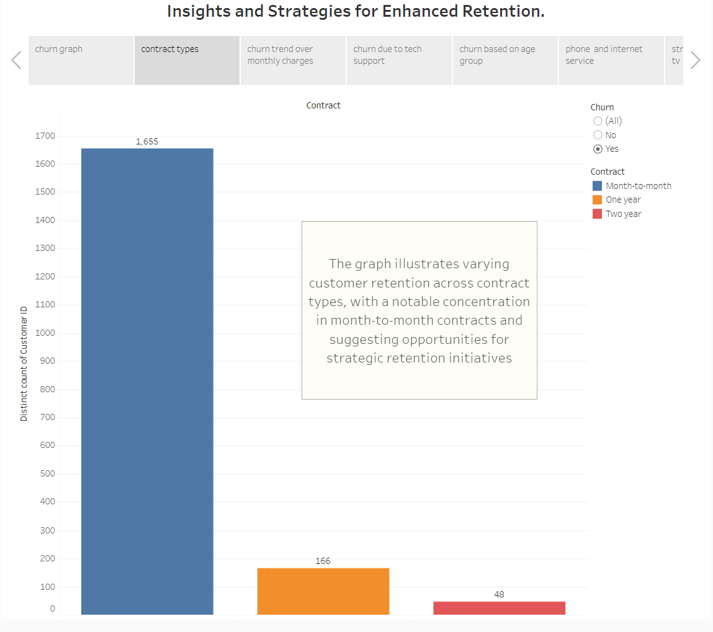
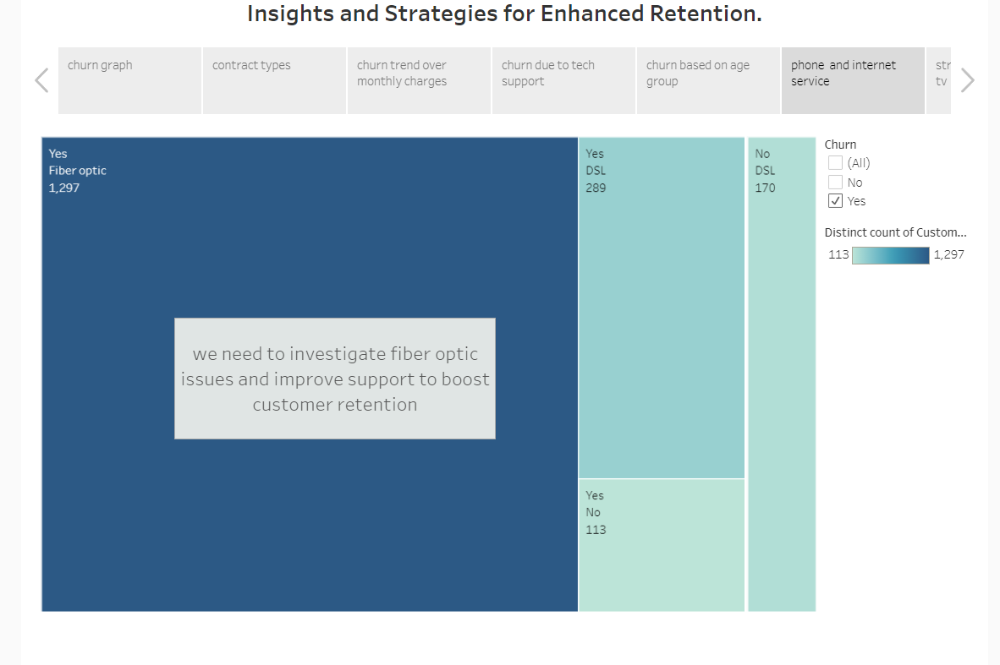

# Telecom Customer Churn Analysis

## Overview
This project analyzes telecom customer churn data to identify factors leading to customer churn and to suggest strategies for improving customer retention.

## Dashboard Screenshots

### 1. Overview of Customer Churn

This pie chart illustrates that 26.54% of customers churned, while 73.46% did not churn. This highlights a significant portion of retained customers, indicating effective retention strategies may already be in place. However, there is potential to further optimize strategies to reduce churn and enhance overall customer satisfaction.

### 2. Churn Based on Senior Citizen Status

The pie chart highlights a significantly higher churn rate among young customers (74.53%) compared to senior citizens (25.47%), emphasizing the importance of implementing strategies to enhance retention among younger demographics.

### 3. Monthly Charges Over the Year

The higher average monthly charges ($63.64) for churned customers imply a possible link between dissatisfaction with pricing and increased customer turnover. This suggests reviewing pricing strategies to address potential dissatisfaction and reduce churn.

### 4. Churn Rate Due to Lack of Technical Support

Higher churn rates among customers receiving limited technical support (49.31%) or no internet service (21.67%) highlight the significant impact of effective technical support on customer retention and satisfaction. Improving technical support could significantly boost retention rates.

### 5. Churn Based on Subscription Plan

The graph illustrates varying customer retention across contract types, with a notable concentration in month-to-month contracts. This suggests opportunities for strategic retention initiatives, such as offering incentives for longer-term contracts or improving month-to-month customer satisfaction.

### 6. Churn Due to Type of Internet

The analysis suggests investigating fiber optic issues and improving support related to internet types to boost customer retention. Addressing these issues may reduce churn and enhance customer satisfaction.

## View the Project on Tableau Public
Interact with the full dashboard on [Tableau Public](https://public.tableau.com/app/profile/akash.thiruveedula/viz/mytelecomcustomerchurnproject/Story1).

## Conclusion
This analysis highlights several key factors influencing customer churn, including pricing, technical support, and subscription plans. Implementing targeted strategies based on these insights can help improve customer retention and satisfaction.
